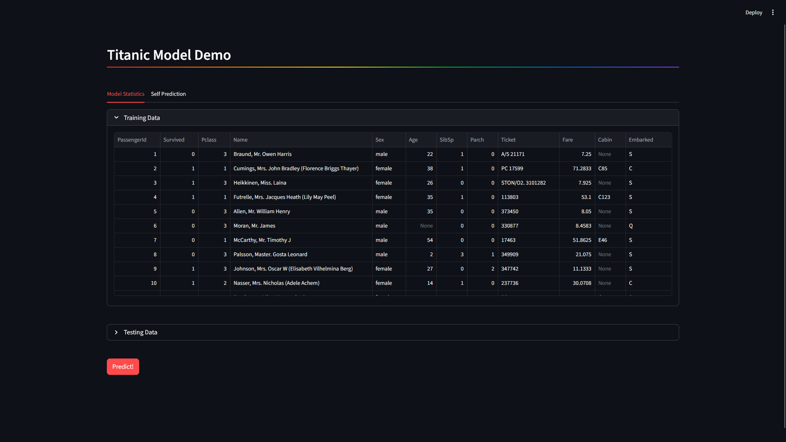
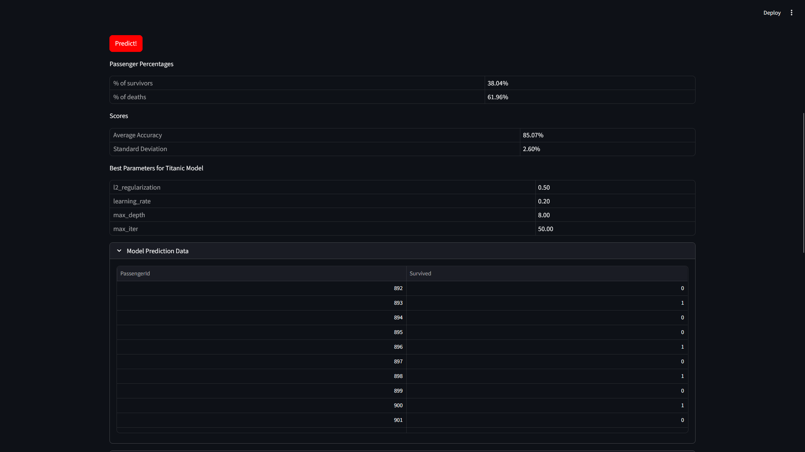
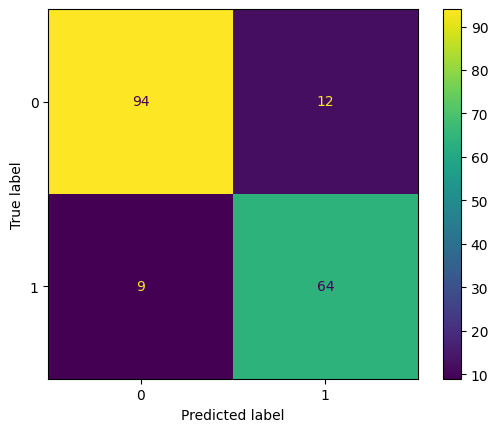
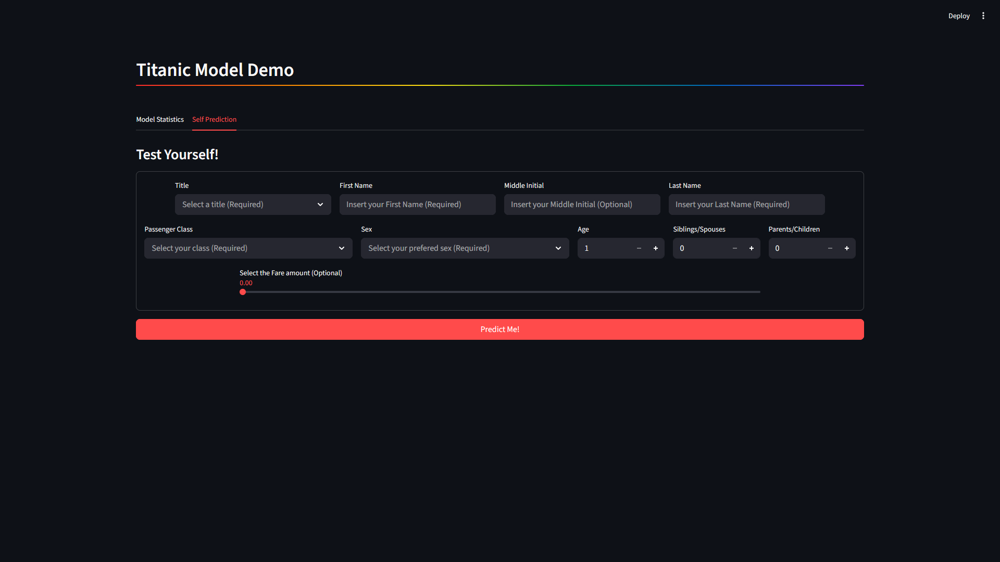
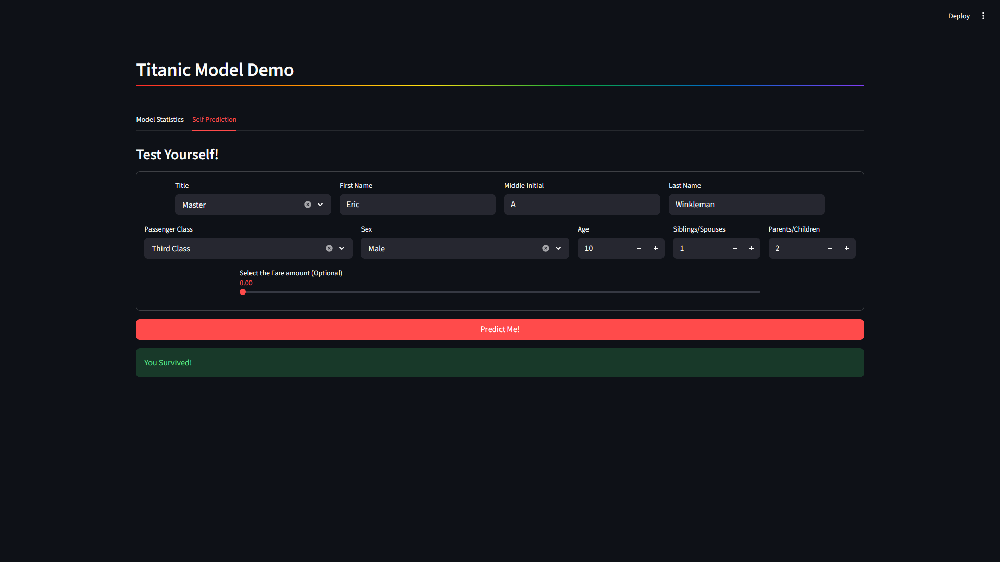
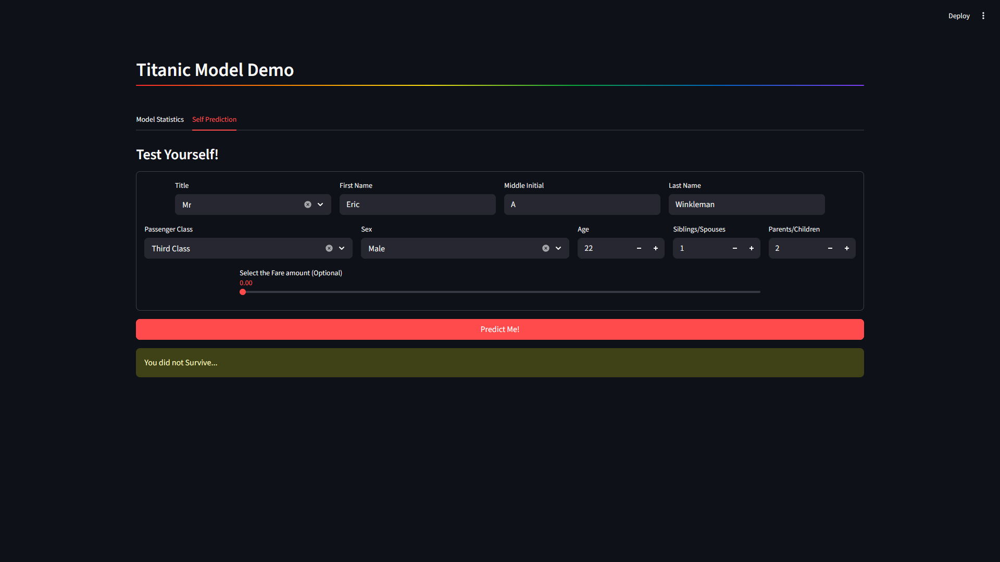

## The Challenge

Excerpt taken straight from (https://www.kaggle.com/c/titanic):

The sinking of the Titanic is one of the most infamous shipwrecks in history.

On April 15, 1912, during her maiden voyage, the widely considered “unsinkable” RMS Titanic sank after colliding with an iceberg. Unfortunately, there weren’t enough lifeboats for everyone onboard, resulting in the death of 1502 out of 2224 passengers and crew.

While there was some element of luck involved in surviving, it seems some groups of people were more likely to survive than others.

In this challenge, we ask you to build a predictive model that answers the question: “what sorts of people were more likely to survive?” using passenger data (ie name, age, gender, socio-economic class, etc).

## What Data is Used?

Two similar datasets are used; columns include passenger information like name, age, gender, socio-economic class, etc.

Train.csv contains the details of a subset of the passengers on board (891) and whether each passenger survived or not. Test.csv dataset contains similar information but does not disclose whether or not each passenger survived.

Using the patterns the model found in the train.csv data, it will attempt to predict if the other 418 passengers found in test.csv survived.

## How is This Data Be Presented to Me?

A simple streamlit frontend is created to load the model and showcase the model's predictive powers. Simply enter in information for the model to predict.

## How to run?

To setup your venv, run the following commands in the terminal:

$ python -m venv .venv
$ python source .venv/bin/activate

Alternatively, you may need to run:

$ python source .venv/Scripts/activate

To install packages, ensure your venv is activated (step above), and run the following commands in the terminal:

$ pip install -r "requirements.txt"

To run the streamlit app, run the following command in the terminal:

$ streamlit run app.py

Navigate to the localhost link provided in a browser to access the app.

## Screenshots

### Model Statistics Screen

Before Button Click:

After Button Click:

Confusion Matrix

### Self Prediction Screen

Before Button Click:

After Button Click (Success):

After Button Click (Failure):

